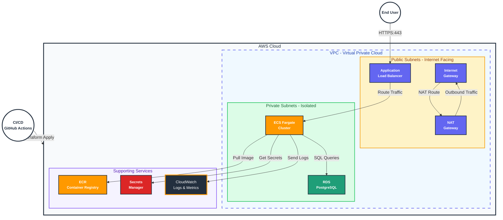

# Production-Grade Cloud Platform

This project creates a fully automated, self-healing, and disposable cloud platform on AWS.

## Architecture



- Compute: AWS ECS Fargate (Serverless Containers)
- Database: AWS RDS PostgreSQL (Private Subnets)
- Networking: VPC with Public/Private subnets, NAT Gateways
- Load Balancing: Application Load Balancer (ALB)
- Security: Least-privilege IAM roles, Security Groups, Secrets Manager, GuardDuty
- CI/CD: GitHub Actions for automated build and deploy

## prerequisites
- AWS Account
- GitHub Account
- Terraform installed
- AWS CLI installed and configured
- Docker installed

## Setup
1. Fork/Clone this repository.
2. Configure Secrets in GitHub/Local environment:
   - `AWS_ACCESS_KEY_ID`
   - `AWS_SECRET_ACCESS_KEY`

## Deployment
### Option 1: Via GitHub Actions
Push to the `main` branch. The `Deploy Platform` workflow will:
1. Provision Infrastructure.
2. Build & Push Docker Image.
3. Deploy Application to ECS.

### Option 2: Local Deployment
Run the automated script:
```bash
./scripts/deploy.sh
```

## Destruction
To completely tear down the environment:
```bash
./scripts/destroy.sh
```

## Resilience
The platform is designed to survive failure:
- Multi-AZ: Resources are spread across multiple Availability Zones.
- Auto-Healing: ECS automatically replaces failed containers. ALB ensures traffic only goes to healthy instances.
- Private Database: The database is isolated in private subnets, accessible only by the application.
